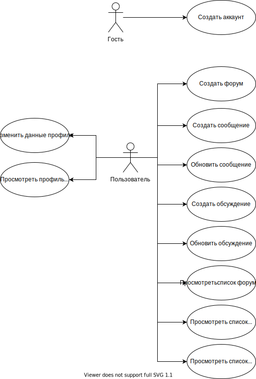
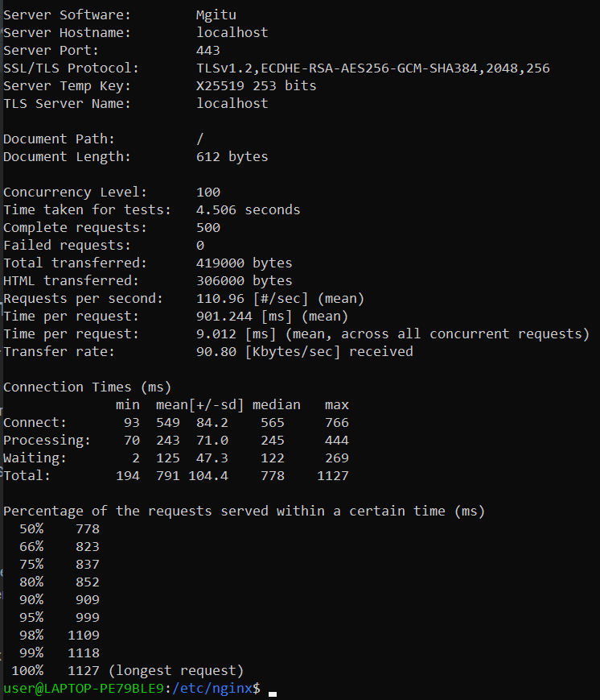

# Web-Project

## Цель работы.

Создание простого в использовании и настройке API форума.

## Краткий перечень функциональных требований.

1) Создание нового форума;
2) Создать аккаунт;
3) Создать тред;
4) Написать сообщение;
5) Обновить сообщение;
6) Обновить тред;
7) Просмотреть профиль пользователя;
8) Изменить данные профиля;
9) Просмотреть список тредов;
10) Просмотреть список форумов;
11) Просмотреть список пользователей.

## Use-case диаграмма системы.

## ER-диаграмма сущностей системы.

## Результаты нагрузочного тестирования

